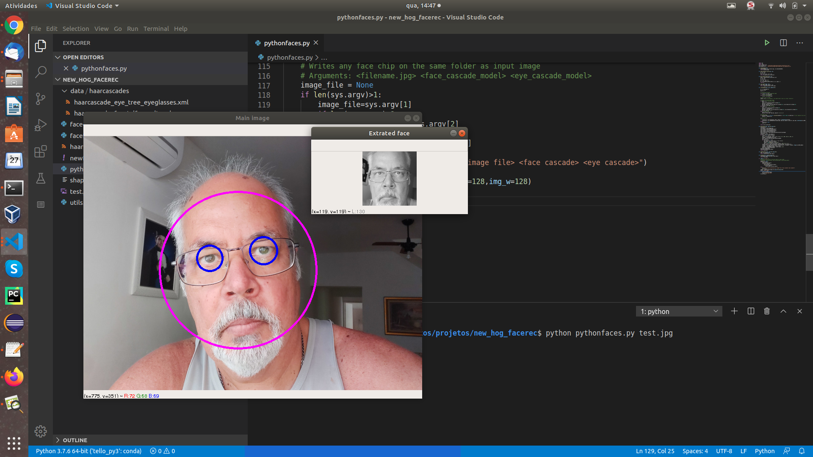

Face Chip extractor

[**Cleuton Sampaio**](https://github.com/cleuton)

[**ENGLISH VERSION HERE**](./english.md)

[](https://www.lcm.com.br/site/#livros/busca?term=cleuton)



Esta é uma biblioteca python que usa o [**OpenCV**](https://opencv.org/) para detectar, alinhar e extrair imagens de rostos, para fins de classificação, seja utilizando [**HOG**](https://github.com/cleuton/hogcomparator) ou [**Rede Neural**](https://github.com/cleuton/FaceGuard/tree/master/FaceRec).

Muita gente, inclusive eu, utiliza uma combinação de bibliotecas para trabalhar as imagens, como: A própria OpenCV, a [**Dlib**](http://dlib.net/), o [**Pillow**](https://pillow.readthedocs.io/en/stable/) etc. Só que é muito confuso e a instalação da Dlib, por exemplo, é extremamente complexa e frustrante.

A OpenCV é mais do que capaz de fazer tudo o que é preciso em um pipeline de processamento de imagens, como: **detetar rostos**, **alinhar rostos** e **extrair rostos**, também conhecidos como **Face Chips**.

## Instalação

Clone este repositório! Se você tiver o [**Anaconda**](https://anaconda.org/) basta criar um ambiente com o arquivo anexo: 

```
conda env create -f newHogEnv.yml
```

Para testar basta rodar o programa [**pythonfaces.py**](./pythonfaces.py): 

```
python pythonfaces.py |imagem.jpg|
```

Ele possui dois outros parâmetros: 

```
python pythonfaces.py |imagem.jpg| |face cascade model| |eye cascade model|
```

Se você informar apenas a imagem, ele assumirá os arquivos que estão na pasta "./data/haarcascades".

O programa detecta os rostos na imagem passada, extraindo cada um deles em uma nova imagem. Ele transforma em monocromática, alinha o rosto (alinha os olhos na horizontal) e corta o rosto da pessoa, em uma forma quadrada no tamanho que você quiser. 

## Uso como biblioteca

Há várias funções úteis nesse módulo e você pode importá-lo assim: 

```
import pythonfaces
```

**detectFaces**

Esta função recebe uma imagem OpenCV (pode ser um frame de vídeo), detecta os rostos existentes nela e retorna uma lista com imagens. A primeira é a imagem original marcada (onde estão os rostos e os olhos) e as outras são as imagems recortadas de cada rosto encontrado (Face Chip), devidamente alinhadas e redimensionadas.

Você pode salvar as imagens com: 

```
cv2.imwrite(|path do arquivo a ser gravado|, |objeto imagem do OpenCV|)
```

Os parâmetros são: 

- **img**: Imagem do OpenCV;
- **img_h, img_w**: Tamanho do "quadrado" de cada Face Chip a ser gerado;
- **face_cascade_file**: Modelo haar cascade para detecção de rostos - incluído em "/data/haarcascades";
- **eye_cascade_file**: Modelo haar cascade para detecção de olhos - idem;

Estes modelos vieram do projeto original do OpenCV no Github. 

Veja o código do [**pythonfaces.py**](./pythonfaces.py) para ver as outras funções. 


