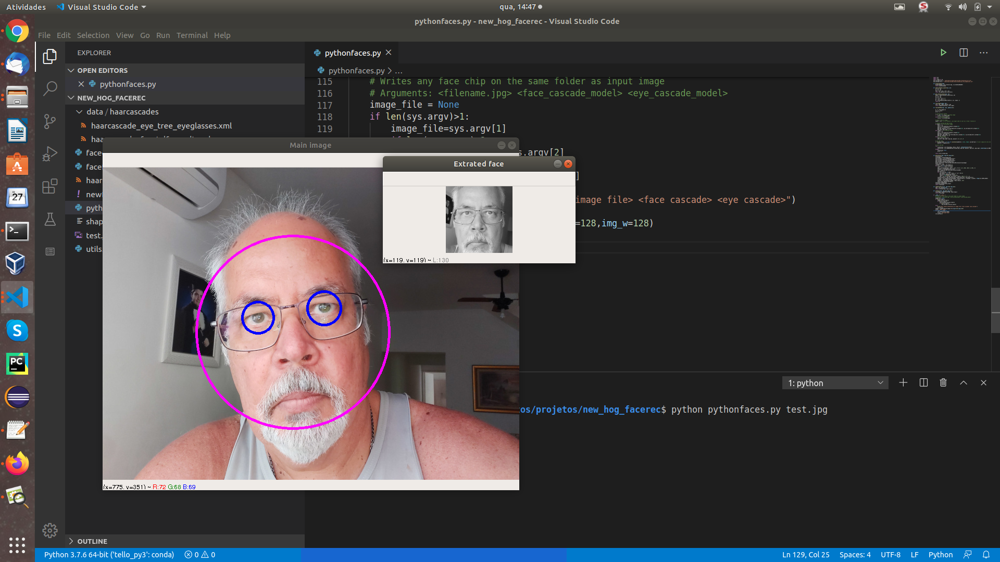

Face Chip extractor

[**Cleuton Sampaio**](https://github.com/cleuton)

This is a python library that uses [**OpenCV**](https://opencv.org/) to detect, align and extract faces images for classification purposes, either using [**HOG**]( https://github.com/cleuton/hogcomparator) or [**Neural Network**](https://github.com/cleuton/FaceGuard/tree/master/FaceRec).

Many people, including me, use a combination of libraries to work on the images, such as: OpenCV itself, [**Dlib**](http://dlib.net/), [**Pillow**]( https://pillow.readthedocs.io/en/stable/) etc. But this is a very confusing and problematic process. Dlib installation, for example, can be extremely complex and frustrating.

OpenCV is more than capable of doing everything that is needed in an image processing pipeline, such as: **detect faces**, **align faces** and **extract faces**, also known as **Face Chips**.

## Installation

Clone this repository! If you have [**Anaconda**](https://anaconda.org/) just create an environment with the attached file:

``
conda env create -f newHogEnv.yml
``

To test just run the program [**pythonfaces.py**](./ pythonfaces.py):

``
python pythonfaces.py |imagem.jpg|
``

It has two other parameters:

``
python pythonfaces.py |image.jpg| |face cascade model| |eye cascade model|
``

If you enter only the image file name, it will assume the files that are in the "./data/haarcascades" folder.

The program detects the faces in the passed image, extracting each one in a new image. It transforms in monochrome, aligns the face (aligns the eyes horizontally) and cuts the person's face, in a square shape to the size you want.

## Use as a library

There are several useful functions in this module and you can import it like this:

``
import pythonfaces
``

**detectFaces**

This function receives an OpenCV image (it can be a video frame), detects the faces in it and returns a list with images. The first is the original marked image (where the faces and eyes are) and the others are the cropped images of each face found (Face Chip), properly aligned and scaled.

You can save the images with:

``
cv2.imwrite(|path of the file to be written|, |OpenCV image object|)
``

The parameters are:

- **img**: OpenCV image;
- **img_h, img_w**: Size of the "square" of each Face Chip to be generated;
- **face_cascade_file**: Model haar cascade for face detection - included in "/ data / haarcascades";
- **eye_cascade_file**: Haar cascade model for eye detection - ditto;

These models came from the original OpenCV project on Github.

See the code for [**pythonfaces.py**](./ pythonfaces.py) for other functions.